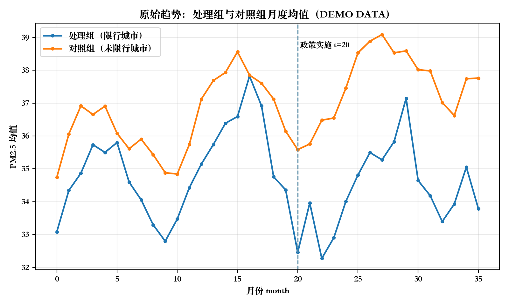
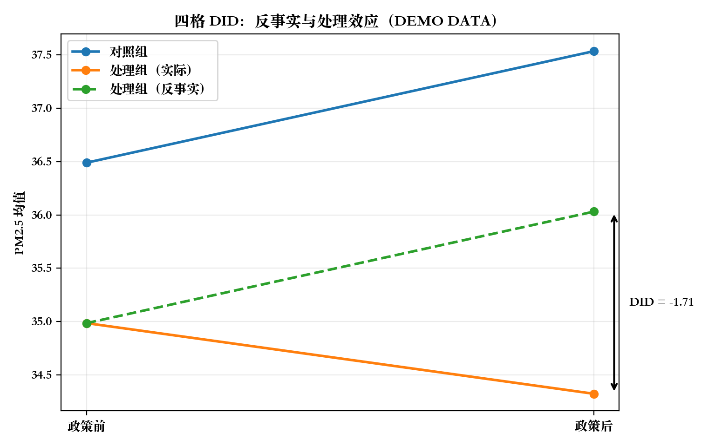
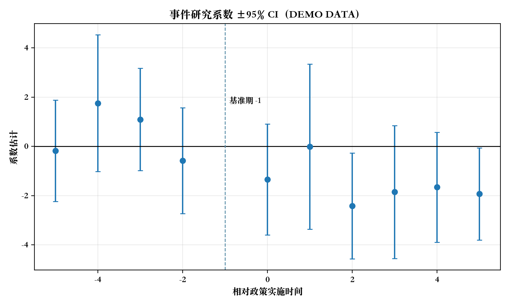
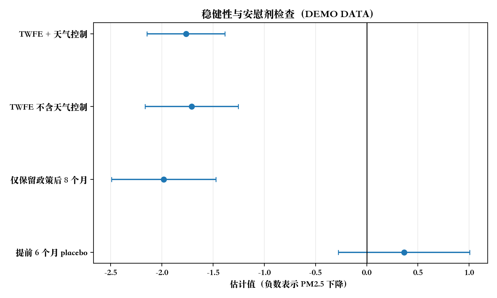

# 8 端到端案例：城市限行政策对 PM2.5 的影响

为了展示完整链路，本 demo 使用合成数据：24 个城市、36 个月、6 个处理城市，政策在第 20 个月实施，数据生成时设定的真实处理效应为 -2.0。特别说明：这些结果只用于验证工作流、图表和报告产出，不构成任何真实政策结论。

## 8.0 从问题到报告的操作链路

本案例完整还原了系统应当执行的步骤，而不是只给一个回归结果。

1. 明确政策问题：某城市交通限行政策是否降低 PM2.5？我们有城市-月份面板数据、政策前后、多个未限行城市。
2. 定义 estimand：处理城市在政策实施后的平均处理效应，近似为 post-period ATT。
3. 构造面板数据：单位是 city-month，结果变量是 `pm25`，处理变量是 `treatment = treated_ever × post`。
4. 方法路由：因为有处理组、对照组、政策前后和面板结构，主方法选择 DID，并用 event study 检查动态效应和预趋势。
5. 先画 raw trends：在回归前检查处理组和对照组政策前走势是否大体可比。
6. 计算四格 DID：把“如果没有政策，处理组会怎样”明确写成反事实均值。
7. 跑 TWFE DID：加入城市固定效应、月份固定效应和天气控制，作为基线回归。
8. 跑 event study：展示政策前 lead 和政策后 lag，不只报告一个点估计。
9. 做稳健性和 placebo：检查窗口、协变量和提前政策时点是否改变结论。
10. 输出复现文件：数据、估计 JSON、DID 中间表、事件研究表、稳健性表、图片和 Markdown 报告。

## 8.1 原始趋势：先看平行趋势

DID 的第一步不是直接跑回归，而是先画 raw trends。图中可以看到处理组和对照组在政策前总体同向波动，政策后处理组均值更低。不过这只是目视检查，不能单独证明平行趋势成立。



图 1. 原始趋势图（DEMO DATA）：处理组与对照组 PM2.5 月度均值。虚线是政策实施月份 t=20。

## 8.2 DID：把反事实讲清楚

DID 的直觉是：如果没有限行政策，处理组在政策后的变化应当和对照组类似。因此先把对照组的前后变化平移到处理组，得到处理组的反事实终点；实际终点和反事实终点之间的差，就是 DID 估计。

四格均值如下：

| 序列 | 时期 | PM2.5 均值 | 角色 | 说明 |
| --- | --- | --- | --- | --- |
| 对照组 | 政策前 | 36.490 | observed | 未限行城市政策前均值 |
| 对照组 | 政策后 | 37.536 | observed | 用于估计共同时间变化 |
| 处理组 | 政策前 | 34.984 | observed | 限行城市政策前均值 |
| 处理组 | 政策后 | 34.321 | observed | 实际观察到的政策后均值 |
| 处理组反事实 | 政策后 | 36.031 | counterfactual | 处理组政策前均值 + 对照组前后变化 |
| DID | 政策后 | -1.709 | effect | 实际处理组政策后 - 反事实处理组政策后 |

计算过程：

```text
对照组变化 = 37.536 - 36.490 = 1.047
处理组反事实政策后 = 34.984 + (37.536 - 36.490) = 36.031
DID = 处理组实际政策后 - 处理组反事实政策后
    = 34.321 - 36.031
    = -1.709
```



图 2. 四格 DID（DEMO DATA）：对照组变化被平移为处理组反事实。本 demo 中四格 DID 为 -1.71，方向与设定的真实效应 -2.0 一致。

## 8.3 事件研究：动态效应与预趋势诊断

事件研究把 DID 拆成相对政策实施时间的动态系数。它有两个作用：第一，看政策前的 lead 是否接近 0，用来诊断预趋势；第二，看政策后的 lag 是否逐步转负或保持负向，用来描述动态效应。



图 3. 事件研究系数 ±95% CI（DEMO DATA）。基准期是 event time = -1。由于这是小型 demo，政策前系数并不完全贴近 0，这正好说明系统不能只看一个 DID 点估计，必须把诊断结果一起呈现。

政策前 lead：

| event time | 估计值 | 标准误 |
| --- | --- | --- |
| -5 | -0.181 | 1.052 |
| -4 | 1.757 | 1.419 |
| -3 | 1.098 | 1.064 |
| -2 | -0.578 | 1.098 |

政策后 lag：

| event time | 估计值 | 标准误 |
| --- | --- | --- |
| 0 | -1.339 | 1.150 |
| 1 | -0.007 | 1.713 |
| 2 | -2.419 | 1.096 |
| 3 | -1.855 | 1.378 |
| 4 | -1.658 | 1.139 |
| 5 | -1.931 | 0.954 |

## 8.4 基线回归：TWFE DID

在四格 DID 之后，系统进一步运行两维固定效应回归：

```text
pm25 ~ treatment + C(city) + C(month) + weather_index
```

这个设定控制了城市不随时间变化的差异、所有城市共同面对的月份冲击，以及 demo 中模拟的天气指标。TWFE 估计值为 `-1.765`，聚类标准误为 `0.195`，样本量为 `864`。

## 8.5 稳健性、安慰剂与诊断结果

完整案例不能只放一个回归表，还要展示检查链路。下面的表把主要估计、协变量敏感性、窗口敏感性和 placebo timing 放在一起。

| 检查 | 估计值 | 标准误 | 95% CI | 样本量 | 解释 |
| --- | --- | --- | --- | --- | --- |
| 四格 DID（全样本） | -1.709 |  |  | 864 | 主展示估计；没有模型标准误，仅作为透明计算。 |
| TWFE + 天气控制 | -1.765 | 0.195 | [-2.147, -1.384] | 864 | 加入城市固定效应、月份固定效应和天气控制。 |
| TWFE 不含天气控制 | -1.709 | 0.232 | [-2.164, -1.255] | 864 | 检查结果是否主要由天气协变量设定驱动。 |
| 仅保留政策后 8 个月 | -1.982 | 0.260 | [-2.492, -1.473] | 672 | 检查短期窗口是否仍为负向。 |
| 提前 6 个月 placebo | 0.365 | 0.327 | [-0.277, 1.006] | 480 | 只使用真实政策前数据；理想情况下应接近 0。 |



图 4. 稳健性与安慰剂检查（DEMO DATA）。负值表示 PM2.5 下降。placebo 只使用真实政策前数据，因此它不是政策效果，而是预趋势/伪政策诊断。

## 8.6 结果解释：能说什么，不能说什么

在这个 demo 中，四格 DID 为 `-1.709`，TWFE DID 为 `-1.765`，都指向政策后处理组 PM2.5 相对下降。因为数据生成时真实效应为 -2.0，结果用于说明工作流能够恢复大致方向。

但这不是一条真实政策结论。真实研究还需要核验政策发布日期、生效日、执行强度、豁免规则、监测站口径、气象冲击、产业变化、跨城市污染转移和相邻城市溢出。如果预趋势诊断不过关，应该降级为设计讨论或重新寻找对照组，而不是强行解释 DID。

## 8.7 复现清单

运行命令：

```bash
python scripts/run_demo_analysis.py
```

本次脚本会生成或更新：

- `examples/data/demo_panel.csv`：合成 city-month 面板数据。
- `examples/outputs/demo_estimates.json`：四格 DID 和 TWFE DID 估计。
- `examples/outputs/demo_did_cells.csv`：四格 DID 与反事实计算中间表。
- `examples/outputs/demo_event_study.csv`：事件研究系数。
- `examples/outputs/demo_robustness.csv`：稳健性和 placebo 检查。
- `examples/outputs/figures/demo_raw_trends.png`：原始趋势图。
- `examples/outputs/figures/demo_four_cell_did.png`：四格 DID 反事实图。
- `examples/outputs/figures/demo_event_study.png`：事件研究图。
- `examples/outputs/figures/demo_robustness.png`：稳健性图。
- `examples/outputs/demo_report.md`：本完整案例报告。
